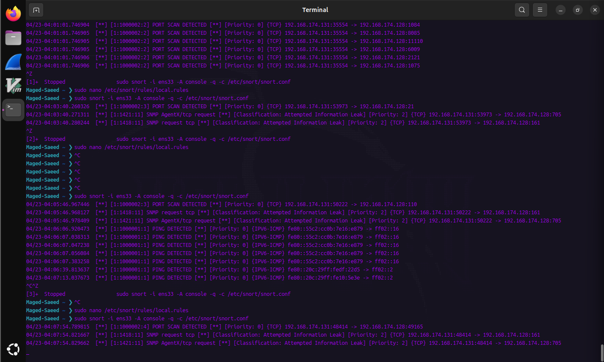
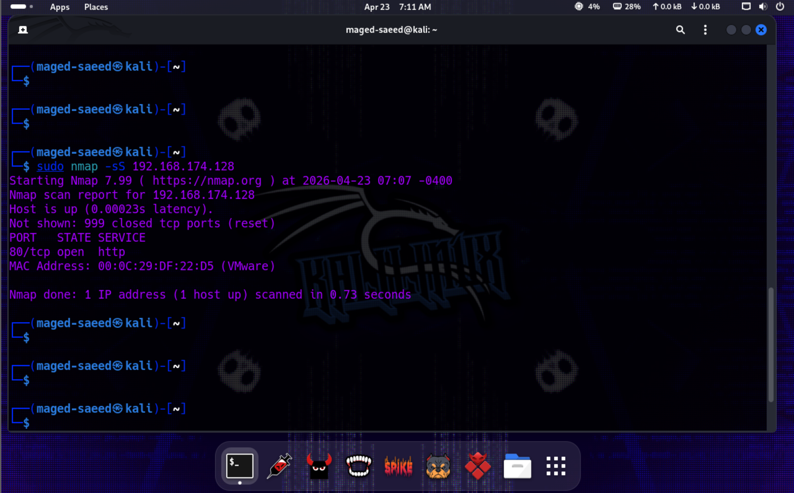
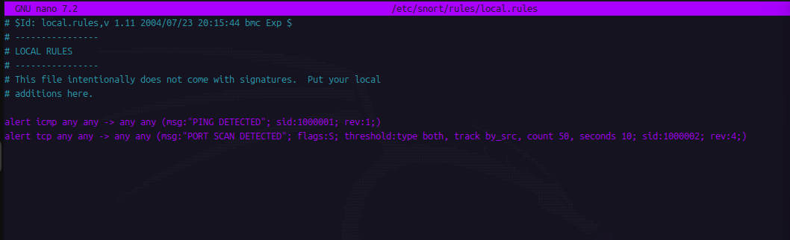

# Snort IDS Lab (Ubuntu + Kali)

## Overview
A simple lab to deploy Snort as an IDS on Ubuntu and detect basic network activity (ICMP ping and TCP SYN port scans) generated from Kali Linux.

---

## Setup
- IDS: Ubuntu + Snort
- Attacker: Kali Linux
- Network: VMware NAT (same subnet)

---

## Rules
```snort
alert icmp any any -> any any (msg:"PING DETECTED"; sid:1000001; rev:1;)
alert tcp any any -> any any (msg:"PORT SCAN DETECTED"; flags:S; threshold:type both, track by_src, count 50, seconds 10; sid:1000002; rev:4;)
```

---

## How it works
1. Snort runs on Ubuntu in IDS mode.
2. Kali sends:
   - Ping → detected by ICMP rule
   - Nmap SYN scan → detected by TCP rule
3. Alerts appear in Snort console.

---

## Screenshots

### Detection (Snort Alerts)


### Attack (Nmap Scan from Kali)


### Custom Rules (local.rules)


---

## Result
- ICMP traffic detected successfully ✔️  
- TCP SYN scan detected ✔️  
- Custom Snort rules working as expected ✔️  

---

## Notes
- This is a basic IDS lab for learning purposes.
- Can be extended with more advanced rules and logging.
update 1 - testing
